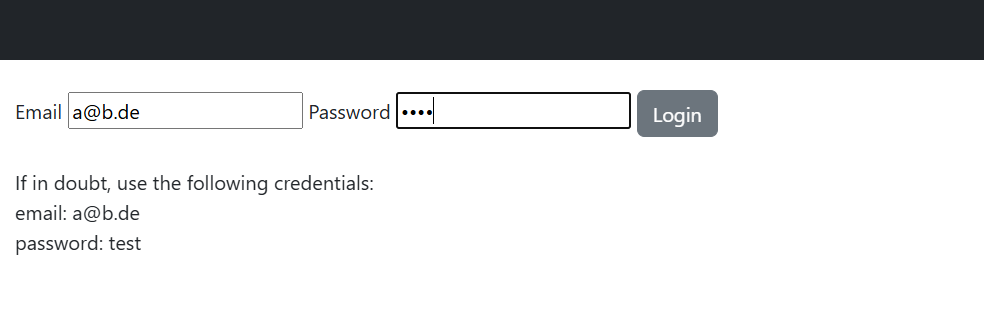
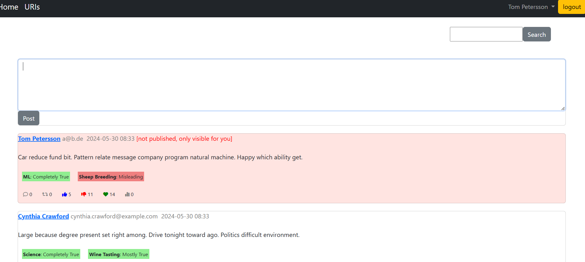

# FameSocialNetwork Project

## Project Overview
The **FameSocialNetwork** is a Django-based social networking application designed to integrate a unique feature called **Fame Profiles**. Inspired by the novel "Fameland" and the concept of epistocracy, Fame Profiles track users' skills and expertise areas, providing both positive and negative recognition based on their contributions.

This system promotes knowledge-driven discussions by enhancing user profiles with skill ratings and discouraging the spread of misinformation through automated content evaluation.

## Features
### 🌟 **Core Social Network Features:**
- User registration and authentication
- Following/unfollowing other users
- Timelines and post management
- Basic search functionality
- Fake data generation for testing





### 📊 **Fame Profile Integration:**
- **Skill Tracking:** Automatically updates user fame profiles based on post content and quality.
- **Positive and Negative Fame:** Rewards users for expertise while penalizing misinformation.
- **Magic AI:** A mock algorithm that identifies expertise areas within posts.
- **Bullshit Filter:** Prevents the publication of posts identified as containing misinformation.

### 🗂️ **API and Views:**
- REST API for post submission and fame profile management
- Views for displaying top experts and identifying users spreading misinformation
- Real-time follow/unfollow functionality integrated into timelines

## Preliminary

You need [pipenv](https://pipenv.pypa.io/en/latest/) to run the project. If you use our
Vagrant VM, please run the following command inside the VM:
```
pip install --user --break-system-packages pipenv
```
If you use our Docker container, please run the following command inside the container:
```
pip install --user pipenv
```

If you are using Windows as OS, you should use the PowerShell to install pipenv and
run the project.

## Installation

Install the project using pipenv in the directory where the `Pipfile` resides. The command

```
pipenv install
```

will create a virtual environment and install the required dependencies. Note that our Docker container only has
Python3.10 installed, however, you may also use this instead with the command
```
pipenv --python /usr/bin/python3 install
```
When using an IDE like PyCharm you want to make sure that that virtual environment is used for the project.

Then
```
pipenv shell
```
will activate that virtual environment.

After working on the project, the virtual environment can be deactivated again using the
```
exit
```
command.

## Unit Tests

To run the unit tests in the virtual environment, use the following command:

```
python manage.py test
```

Recall to disable the failing tests and enable them one by one to see the failing tests. 
Note that the tests use the fixture `database_dump.json`.

## Server

To run the server in the virtual environment, use the following command:
```
python manage.py runserver
```

If you are using our Vagrant VM or our Docker container, you need to explicitly specify the IP address and port:
```
python manage.py runserver 0.0.0.0:8000
```

In both cases, you can access the server in a browser of your choice under http://127.0.0.1:8000/.

## Models, Database, and Fake Data

Use the script
```
recreate_models_and_data.sh
```
to recreate the migrations, database, fake data and fixtures.
